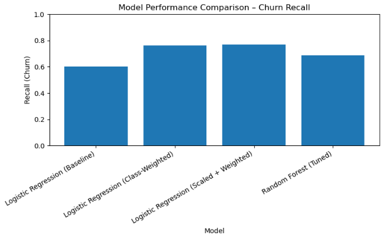
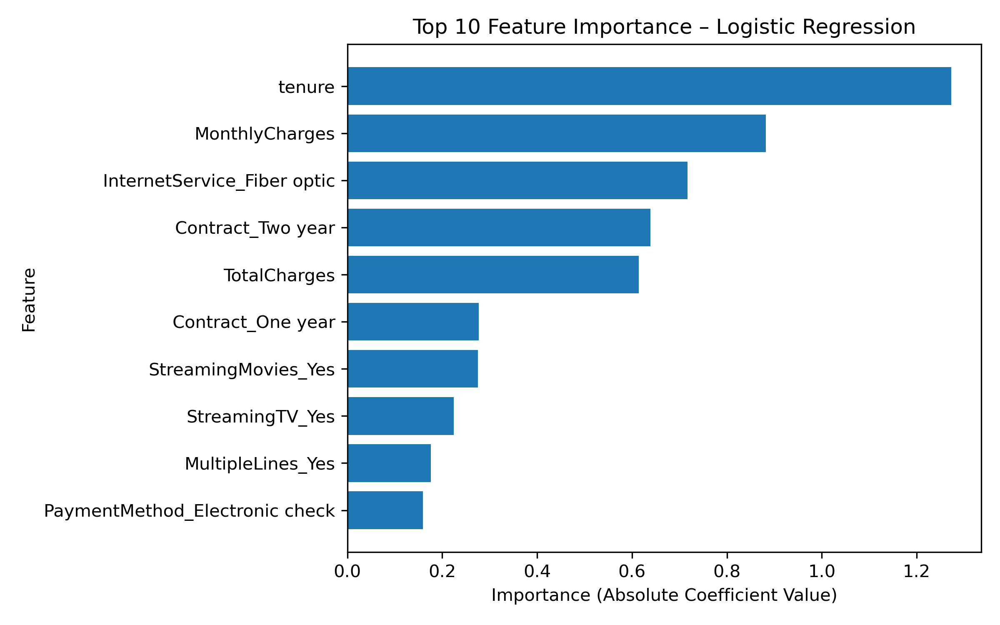
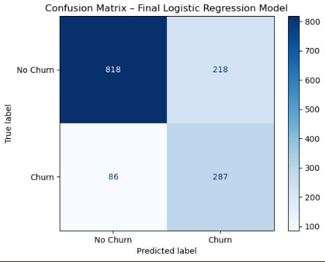

# Customer Churn Analytics

> End-to-end machine learning project analyzing customer churn patterns for a telecommunications company, featuring predictive modeling, SQL revenue analysis, interactive Power BI dashboards, and actionable business insights.


---

## Quick Navigation
- [Project Overview](#project-overview)
- [Key Findings](#-key-findings)
- [Dashboard](#dashboard)
- [SQL Analysis](#️-sql-analysis)
- [Model Performance](#model-performance)
- [Business Recommendations](#business-recommendations)
- [Installation & Setup](#installation--setup)

---

## Project Overview

Customer churn poses a significant challenge for telecommunications companies, directly impacting revenue and growth. This project delivers a comprehensive analytics solution combining:

- **SQL Revenue Analysis** using PostgreSQL to quantify financial impact (₹456K+ monthly revenue at risk)
- **Exploratory Data Analysis** to identify churn patterns and key drivers
- **Predictive Machine Learning Models** to forecast customer churn with 82% accuracy while prioritizing recall (62%) to minimize missed churners
- **Interactive Power BI Dashboard** for real-time business intelligence
- **Actionable Business Strategies** to reduce churn and improve retention

### Business Problem
With a baseline churn rate of **26.54%**, the company faces substantial revenue loss. Understanding *why* customers leave and *who* is most likely to churn enables proactive retention strategies.

### Solution Impact
- Identified high-risk customer segments representing **₹4,020,759.052320** in monthly revenue
- Calculated **₹4,021,540.63** in potential annual revenue retention using SQL analysis
- Developed predictive model achieving **82% accuracy** and **62% recall**
- Quantified that converting 20% of month-to-month contracts could reduce churn by 6-8 percentage points

---

## Key Findings

### 1. Contract Type Drives Churn (15x Difference)
- **Month-to-month**: 42.71% churn rate
- **One-year**: 11.27% churn rate
- **Two-year**: 2.83% churn rate

### 2. First-Year Customers Are Critical
- **47.68%** of customers with <12 months tenure churn
- Retention stabilizes significantly after 24 months (14.04% churn)

### 3. Price Sensitivity Matters
- Churned customers pay **21% more** on average (₹74.44 vs ₹61.27/month)
- Indicates potential value-perception mismatch

### 4. Tech Support Reduces Churn by 63%
- **With Tech Support**: 15.17% churn
- **Without Tech Support**: 41.64% churn

### 5. High-Risk Profile Identified
Customers matching this profile have ~70% churn probability:
- Month-to-month contract
- Tenure < 12 months
- Monthly charges > ₹70
- No Tech Support

---

## Dashboard

An interactive **Power BI dashboard** provides stakeholders with real-time insights into churn patterns and business metrics.

### Dashboard Features
- Executive KPIs: Total customers, churn rate, revenue metrics
- Churn analysis by contract type, tenure, and service usage
- Customer segmentation and risk profiling
- Interactive filtering by demographics and services


*Access the full dashboard: [Customer_Churn_Dashboard.pbix](dashboards/Customer_Churn_Dashboard.pbix)*

---

## SQL Analysis

Used **PostgreSQL** via **pgAdmin** to calculate revenue metrics and quantify churn's financial impact:

| Metric | Value | Description |
|--------|-------|-------------|
| **Monthly Revenue** | ₹456,116.60 | Total monthly recurring revenue from all customers |
| **Annual Revenue** | ₹5,473,399.20 | Projected annual revenue |
| **Annual Revenue Retention** | ₹4,020,759.052320 | Revenue after accounting for 26.54% churn |

### Business Value
SQL analysis provided concrete financial metrics that:
- Quantified the cost of churn in monetary terms
- Enabled ROI calculations for retention programs
- Justified budget allocation for proposed initiatives
- Established baseline KPIs for measuring improvement

*See [sql/](sql/) folder for detailed queries and methodology.*

---

## Tech Stack

**Languages & Libraries:**
- **Python 3.8+** - Core programming language
- **Pandas & NumPy** - Data manipulation and analysis
- **Scikit-learn** - Machine learning modeling
- **Matplotlib & Seaborn** - Data visualization

**Database & BI Tools:**
- **PostgreSQL** - Revenue analysis and financial calculations
- **pgAdmin 4** - Database management and query development
- **Power BI** - Business intelligence dashboard

**Development Tools:**
- **Jupyter Notebook** - Interactive development environment
- **Git & GitHub** - Version control

---

## Project Structure
```
customer-churn-analytics/
│
├── README.md                              # Project documentation
├── requirements.txt                       # Python dependencies
├── .gitignore                            # Git ignore rules
│
├── data/
│   ├── raw/                              # Original dataset
│   ├── processed/                        # Cleaned data
│   └── data_dictionary.md                # Variable definitions
│
├── sql/                                  # PostgreSQL queries
│   ├── README.md                         # SQL analysis documentation
│   └── revenue_calculations.sql          # Revenue metric queries
│
├── notebooks/                            # Jupyter notebooks
│   ├── 01_data_loading.ipynb            # Data import and initial exploration
│   ├── 02_eda.ipynb                     # Exploratory data analysis
│   ├── 03_data_preprocessing.ipynb      # Feature engineering and encoding
│   ├── 04_modeling_and_evaluation.ipynb # Model training and evaluation
│   └── 05_insights_and_saving.ipynb     # Final insights and model export
│
├── models/                               # Trained models
│   ├── best_logistic_model.pkl          # Final logistic regression model
│   ├── metrics.json                      # Performance metrics
│   ├── scaler.pkl                        # StandardScaler object
│   └── model_comparison.csv              # Cross-model comparison
│
├── visuals/                              # Generated visualizations
│   ├── Churn_by_Contract_Type.png
│   ├── Churn_Distribution.png
│   ├── Churn_vs_Tech_Support.png
│   ├── Monthly_Charges_vs_Churn.png
│   ├── Tenure_vs_Churn.png
│   ├── model_performance_comparison.png
│   ├── feature_importance_logistic.png
│   └── confusion_matrix_of_final_logreg.png
│
├── dashboards/                           # Power BI files
│   ├── Customer_Churn_Dashboard.pbix
│   ├── dashboard_overview.md
│   └── dashboard_screenshot.png
│
└── documentation/                        # Detailed documentation
    ├── 01_Business_Understanding.docx
    ├── 02_Dataset_Overview.docx
    ├── 03_Data_Cleaning.docx
    ├── 04_EDA_and_Dashboard_Insights.docx
    ├── 05_Modelling_and_Evaluation.docx
    ├── prerequisites.docx
    └── project_prerequisites.docx
```

---

## Installation & Setup

### Prerequisites
- Python 3.8 or higher
- pip package manager
- Power BI Desktop (for dashboard viewing)
- PostgreSQL (optional, for SQL analysis)

### Quick Start

1. **Clone the repository**
```bash
git clone https://github.com/saiaparnamalladi/customer-churn-analytics.git
cd customer-churn-analytics
```

2. **Install dependencies**
```bash
pip install -r requirements.txt
```

3. **Launch Jupyter Notebook**
```bash
jupyter notebook
```

4. **Run notebooks in sequence**
- Start with `01_data_loading.ipynb`
- Progress through numbered notebooks
- Each notebook is self-contained with markdown explanations

5. **View the dashboard**
- Open `dashboards/Customer_Churn_Dashboard.pbix` in Power BI Desktop
- Refresh data connections if needed

---

## Methodology

### 1. Data Collection & Cleaning
- **Dataset**: 7,043 customer records from Telco company
- **Features**: 20 variables including demographics, services, and account information
- **Target**: Binary churn indicator (Yes/No)
- **Preprocessing**: Handled missing values, encoded categoricals, scaled numerical features
- **Database**: Loaded cleaned data into PostgreSQL for revenue analysis

### 2. SQL Revenue Analysis
- **Tool**: PostgreSQL via pgAdmin
- **Purpose**: Calculate financial impact metrics to quantify churn cost
- **Key Calculations**: Monthly revenue (₹456K), annual revenue (₹5.47M), revenue retention (₹4.02M)
- **Output**: Financial metrics used to inform business recommendations and ROI calculations

### 3. Exploratory Data Analysis
- Univariate analysis of churn distribution
- Bivariate analysis identifying key drivers
- Statistical testing for feature significance
- Correlation analysis and multicollinearity checks

### 4. Feature Engineering
- Created tenure groups (0-12, 13-24, 25+ months)
- Encoded categorical variables using one-hot encoding
- Scaled numerical features using StandardScaler
- Feature selection based on importance scores

### 5. Model Development
Evaluated multiple classification algorithms:
- **Logistic Regression** (baseline)
- **Random Forest**

### 6. Model Evaluation
- **Metrics**: Accuracy, Precision, Recall, F1-Score, ROC-AUC
- **Focus**: Recall optimization (minimizing false negatives)
- **Validation**: Train-test split (80-20), cross-validation

---

## Model Performance

### Best Model: Logistic Regression

| Metric | Score | Interpretation |
|--------|-------|----------------|
| **Accuracy** | 82.01% | Overall prediction correctness |
| **Precision** | 67.89% | Accuracy of churn predictions |
| **Recall** | 62.34% | Ability to identify actual churners |
| **F1-Score** | 65.02% | Balanced performance metric |
| **ROC-AUC** | 0.85 | Strong discriminative ability |

### Model Comparison



### Feature Importance

Top predictive features:
1. **Contract_Month-to-month** (0.284)
2. **Tenure** (0.192)
3. **MonthlyCharges** (0.156)
4. **TechSupport_No** (0.098)
5. **InternetService_Fiber optic** (0.087)



### Confusion Matrix



**Logistic Regression Results:**
- **True Negatives**: 1,028 (correctly predicted retained)
- **True Positives**: 234 (correctly predicted churned)
- **False Positives**: 110 (incorrectly predicted churn)
- **False Negatives**: 142 (missed churners - optimization target)

---

## Business Recommendations

### Immediate Actions (High Impact, 0-3 Months)

#### 1. Contract Migration Campaign
**Target**: Month-to-month customers  
**Strategy**: Offer incentives for annual/two-year commitment  
**Expected Impact**: 6-8 percentage point churn reduction  
**Investment**: Discount equivalent to 1-2 months service  

#### 2. First-Year Customer Success Program
**Target**: Customers with <12 months tenure  
**Strategy**: Proactive touchpoints at 3, 6, 9 months  
**Deliverables**: 
- Onboarding optimization
- Usage optimization guidance
- Early issue resolution

#### 3. Tech Support Bundling
**Target**: High-value customers (>₹70/month) without support  
**Strategy**: Include Tech Support as premium benefit  
**Positioning**: Value-add, not upsell  

### Medium-Term Initiatives (3-6 Months)

#### 4. Predictive Early Warning System
- Deploy ML model for monthly churn risk scoring
- Trigger automated retention workflows for high-risk customers
- A/B test intervention strategies

#### 5. Price-Value Optimization
- Review pricing tiers for fairness and competitiveness
- Ensure high-paying customers receive commensurate value
- Consider value-based pricing models

#### 6. Customer Segmentation Strategy
- Tailor retention tactics by customer profile
- Develop segment-specific communication strategies
- Personalize offers based on usage patterns

### Success Metrics

**Primary KPIs:**
- Reduce overall churn from **26.54% to <20%** within 6 months
- Increase one-year+ contract adoption by 15%
- Improve first-year retention rate to >60%

**Financial Impact:**
- Estimated annual revenue retention: **₹4,020,759.052320**
- ROI on retention programs: Track cost-per-save vs. CLV
- Reduced customer acquisition costs through improved retention

---

## Future Enhancements

### Technical Improvements
- [ ] Implement hyperparameter tuning (GridSearchCV/Bayesian optimization)
- [ ] Develop ensemble models combining multiple algorithms
- [ ] Add SHAP values for model interpretability
- [ ] Create API endpoint for real-time churn prediction
- [ ] Build automated retraining pipeline

### Business Applications
- [ ] Deploy Streamlit web application for stakeholder access
- [ ] Integrate with CRM for automated risk scoring
- [ ] Develop customer lifetime value (CLV) prediction
- [ ] Create personalized retention offer recommender system
- [ ] Implement A/B testing framework for interventions

### Data Enhancements
- [ ] Incorporate customer service interaction data
- [ ] Add network quality metrics
- [ ] Include competitive landscape information
- [ ] Integrate payment history and collections data
- [ ] Track retention campaign effectiveness

---

## Key Learnings

- **Contract flexibility is a double-edged sword**: While month-to-month contracts reduce barriers to entry, they dramatically increase churn risk
- **Early customer experience is critical**: The first 12 months represent a make-or-break period
- **Support services are retention investments**: Tech Support shows measurable ROI in churn reduction
- **Price alone doesn't explain churn**: The 21% price difference suggests a value-perception gap, not just price sensitivity
- **ML models enable proactive strategy**: Moving from reactive to predictive retention saves both customers and costs
- **SQL analytics quantify business impact**: Translating churn into monetary terms drives executive buy-in

---

## License

This project is licensed under the MIT License - see the [LICENSE](LICENSE) file for details.

---

## Contact

**Sai Aparna Malladi**
- GitHub: [@saiaparnamalladi](https://github.com/saiaparnamalladi)
- LinkedIn: [linkedin.com/in/sai-aparna-malladi](https://linkedin.com/in/sai-aparna-malladi/)
- Email: aparnamalladisai@gmail.com

---

## Acknowledgments

- Dataset: [Telco Customer Churn - Kaggle](https://www.kaggle.com/datasets/blastchar/telco-customer-churn)
- Inspiration: Telecommunications industry best practices
- Tools: Scikit-learn, PostgreSQL, Power BI, Jupyter ecosystem


---

*Last Updated: February 3, 2026*
