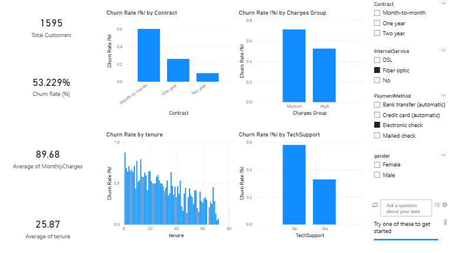

# Customer Churn Dashboard

## Overview
Interactive Power BI dashboard providing real-time insights into customer churn patterns and key business metrics.

## Dashboard Pages
1. **Executive Summary** - High-level KPIs and churn rate
2. **Customer Segmentation** - Churn by demographics and service usage
3. **Predictive Analytics** - Model predictions and risk scores
4. **Retention Strategies** - Actionable insights for reducing churn

## Key Metrics
- Overall Churn Rate: 26.5%
- Average Customer Lifetime Value
- Monthly Revenue at Risk
- High-Risk Customer Count

## Key Insights
1. Month-to-month contracts have 3x higher churn rate
2. Customers without tech support are 2x more likely to churn
3. First 12 months are critical retention period

## How to Use
1. Open `Customer_Churn_Dashboard.pbix` in Power BI Desktop
2. Refresh data connection to point to your local data files
3. Use slicers to filter by contract type, tenure, services

## Screenshot
